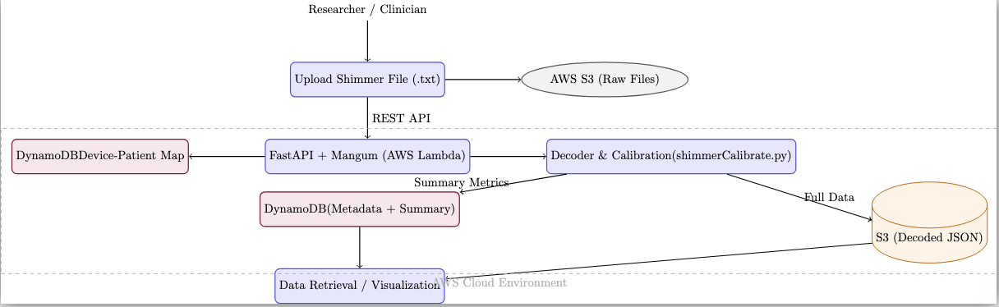

# Shimmer Data Sync API

RESTful API for managing and processing Shimmer wearable sensor data in the cloud. Handles file uploads to S3, decodes binary sensor streams with inertial calibration, stores metadata in DynamoDB, and provides endpoints for patient management and data retrieval.

## Quick Links

- [Key Features](#key-features)
- [Flexible Time-Based Grouping](#flexible-time-based-grouping-for-shimmer-data)
- [Calibration and Decoding Script](#calibration-and-decoding-script-improvements)
- [API Endpoints](#key-endpoints)
- [Setup](#setup)
- [Architecture Overview](#architecture-overview)
- [DynamoDB Size Limit Solution](#dynamodb-size-limit-solution)
- [Project Structure](#project-structure)
- [Contributing](#contributing)
- [License](#license)


## Key Features

### Data Management
- Upload Shimmer sensor files (.txt) to S3
- Automatic filename parsing (device, timestamp, experiment, shimmer device)
- Patient-device mapping with DynamoDB
- Batch file downloads (by day, by user/date)
- Generate presigned upload/download URLs

### Sensor Data Processing
- Binary sensor data decoding (Shimmer3 format)
  - 256-byte header: device info, sample rate, enabled sensors, calibration parameters
  - Variable-length data packets (3-byte timestamp + sensor channels)
- Multi-channel support with raw and calibrated data:
  - Accel_LN (Low-Noise Accelerometer): X, Y, Z axes
  - Accel_WR (Wide-Range Accelerometer): X, Y, Z axes
  - Gyro (Gyroscope): X, Y, Z axes
  - Mag (Magnetometer): X, Y, Z axes
  - Each channel provides both raw and calibrated (_cal) values
- Inertial sensor calibration
  - Offset correction, gain scaling, alignment matrix (applied to all inertial sensors)
- Time synchronization with phone RTC and rollover correction
  - Initial RTC sync from phone timestamp (Unix epoch)
  - Output: Unix timestamps in `timestampCal`, ISO 8601 in `timestampReadable`
- Computed metrics:
  - `Accel_WR_Absolute`: Magnitude (√(x² + y² + z²)) for each sample
  - `Accel_WR_VAR`: Range (max - min) of absolute acceleration
    - UWB distance (`uwbDis`): Ultra-wideband distance readings (float, meters or device units)
    - `uwbDis`: List of UWB distance readings per sample (if available)

### Smart Storage
- Full decoded data → S3 as JSON (handles 60k+ samples)
- Summary metrics only → DynamoDB (stays under 400KB limit)
- Scalable architecture for large sensor datasets

### Flexible Time-Based Grouping for Shimmer Data
- Decoded records are grouped by device and patient, then split into groups where all records are within a tunable time window (default: 15 seconds) of each other, regardless of date boundaries.
- Each group is assigned a unique `group_id` (e.g., `group1`, `group2`, ...) based on the earliest timestamp in the group.
- Shimmer assignment: Within each group, decoded data is assigned to `shimmer1_decoded` or `shimmer2_decoded` based on the device mapping from DynamoDB, not just by order or presence.
- Single-shimmer groups: If only one shimmer is present in a group, it is still assigned to the correct field based on the mapping, and the other field is left empty.
- This grouping approach ensures all records within a group are temporally close (within 15 seconds), supporting flexible analysis and robust downstream processing. Grouping is based on time proximity, not by calendar date.
- When combining files, shimmer assignment is always determined by looking up the device's mapping in DynamoDB (device-patient map). The system does not assign by order or filename, but uses the mapping to ensure each decoded record is placed in the correct field (`shimmer1_decoded` or `shimmer2_decoded`).

### Calibration and Decoding Script Improvements
- The calibration and decoding script (`shimmerCalibrate.py`) is a direct Python port of the MATLAB function, with robust handling for:
  - Binary decoding of Shimmer3 files, including dynamic channel parsing and custom 24-bit signed integer support.
  - Inertial sensor calibration (offset, gain, alignment) for all axes and sensor types.
  - Time calibration with rollover correction and smoothing, outputting both Unix and ISO 8601 timestamps.
  - Output file naming now preserves the original base name for both `.mat` and `.json` files.
  - All array math is implemented using standard Python (no NumPy required).
  - Optional plotting and MATLAB file export if dependencies are available.

### Smart Storage
- **Full decoded data** → S3 as JSON (handles 60k+ samples)
- **Summary metrics only** → DynamoDB (stays under 400KB limit)
- Scalable architecture for large sensor datasets

### API Endpoints
- File operations (upload, download, list, search)
- Device-patient mapping (CRUD operations)
- File metadata with grouping by device/date
- Decode and store sensor data
- Retrieve full decoded data from S3

## Tech Stack
- **Backend**: FastAPI with Mangum (AWS Lambda compatible)
- **Storage**: AWS S3 (raw files + decoded JSON)
- **Database**: AWS DynamoDB (metadata + summaries)
- **Deployment**: AWS Lambda with API Gateway

## Architecture Overview

<p align="center"> 
  <br/>
  <b>Figure: Shimmer Data Sync API Architecture</b>
</p>

**User → API → AWS Pipeline**

- Researchers upload Shimmer sensor `.txt` files via REST API.

**FastAPI + Mangum (Lambda)**
- Entry point that handles routing, upload, decode requests, and DynamoDB/S3 interactions.

**Shimmer Decoder (`shimmerCalibrate.py`)**
- Parses binary stream → applies calibration → generates calibrated data.

**AWS S3**
- Stores raw uploaded files.
- Stores full decoded JSON (large datasets).

**AWS DynamoDB**
- Stores file metadata and summary metrics.
- Maintains device–patient mappings.

**Retrieval Layer**
- Allows fetching summarized data quickly or full decoded datasets from S3 when needed.

## Setup

### Local Development
1. Install dependencies:
   ```sh
   pip install fastapi uvicorn boto3 python-dotenv mangum pydantic
   ```

2. Configure environment variables (`.env`):
   ```env
   S3_BUCKET=your-bucket-name
   DDB_TABLE=your-device-patient-db
   DDB_FILE_TABLE=your-file-db
   AWS_REGION=your-region
   ```

3. Run locally:
   ```sh
   uvicorn main:app --reload
   ```

### AWS Lambda Deployment
1. Package dependencies:
   ```sh
   pip install -t lambda_package/ -r requirements.txt
   cp main.py shimmer_decode.py shimmerCalibrate.py lambda_package/
   cd lambda_package && zip -r ../lambda_package.zip .
   ```

2. Deploy to Lambda and configure API Gateway

## Key Endpoints

### File Management
- `POST /upload/` - Upload Shimmer sensor file
- `GET /files/` - List all files
- `GET /files/metadata/` - Get files grouped by device/date/patient
- `GET /files/combined-meta/` - Get combined metadata from DynamoDB
- `GET /download/{filename}` - Download file
- `POST /download-zip-by-day/` - Download all files for a date
- `POST /download-zip-by-user-date/` - Download files for user/date

### Sensor Data Processing
- `GET /file/decode/` - Decode sensor file (returns full data)
- `POST /decode-and-store/` - Decode and store (summary in DDB, full data in S3)
- `GET /file/decoded-full/` - Retrieve full decoded data from S3

### Device/Patient Mapping
- `GET /ddb/device-patient-map` - List all mappings
- `GET /ddb/device-patient-map/{device}` - Get mapping for device
- `PUT /ddb/device-patient-map/{device}` - Create/update mapping
- `DELETE /ddb/device-patient-map/{device}` - Delete mapping
- `GET /devices/unregistered` - Find devices without patient mapping

## Architecture Notes

### DynamoDB Size Limit Solution
Shimmer files can contain 60,000+ samples, making arrays too large for DynamoDB's 400KB item limit. Our solution:

1. **Full decoded data** → Stored in S3 at `decoded/{filename}.json`
2. **Summary metrics** → Stored in DynamoDB (num_samples, accel_wr_var, etc.)
3. **Reference link** → DynamoDB item includes `decoded_s3_key` for full data retrieval
4. **Recording timestamp** → DynamoDB includes `recordedTimestamp` field with human-readable ISO format timestamp (e.g., `2024-09-24T22:38:36+00:00`)
   - Shimmer files store timestamps as Unix timestamps (seconds since epoch) in the `timestampCal` array
   - The first value from `timestampCal[0]` is extracted and converted from Unix format to ISO 8601 format with UTC timezone
   - This provides quick access to recording start time without fetching the full 60k-sample timestamp array from S3

  **Note:** The `recordedTimestamp` is rounded down to the nearest lower 10-second boundary (e.g., 39 and 32 become 30) for consistency in metadata. The original `timestampCal` array in the decoded data is not modified and retains its full precision.

This keeps DynamoDB items small (~2-5 KB) while preserving full data access via S3 and providing quick access to key metadata like recording start time.

## Project Structure
```
.
├── main.py                    # FastAPI application & endpoints
├── shimmerCalibrate.py        # Calibrated decoder with inertial cal
├── test/                      # scripts to test the decoder code
└── README.md
```

- **Flexible Time-Based Grouping for Shimmer Data:**
  - Decoded records are grouped by device and patient, and then split into groups where all records are within a tunable time window (default: 15 seconds) of each other, regardless of date boundaries.
  - Each group is assigned a unique `group_id` (e.g., `group1`, `group2`, ...) based on the earliest timestamp in the group.
  - This allows for robust handling of recordings that are close in time but not exactly synchronized, and supports both single- and dual-shimmer scenarios. Grouping is not strictly by date, but by temporal proximity.


## Contributing
This project is part of the Shimmer UMass research platform. For access or collaboration, contact the Shimmer research team.

## License
This project is licensed under the MIT License - see the [LICENSE](LICENSE) file for details.
